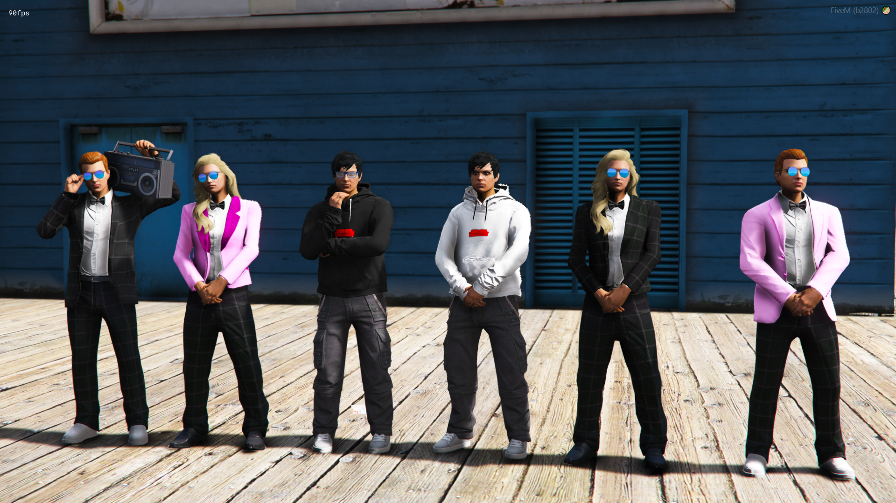
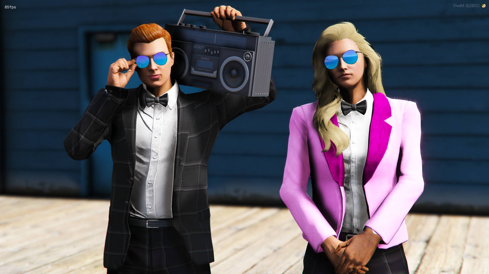
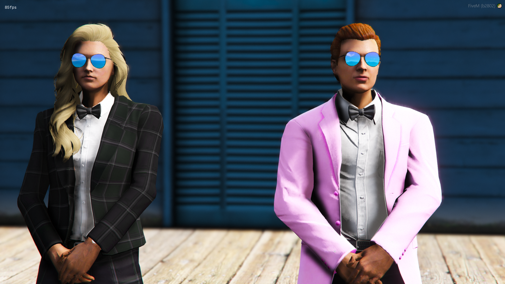
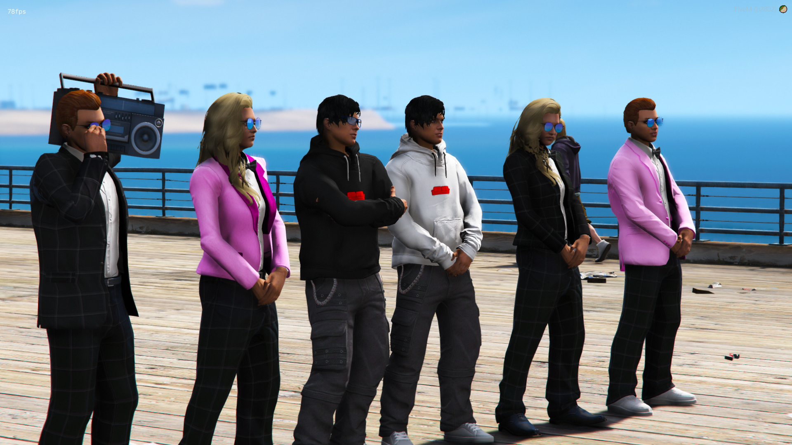
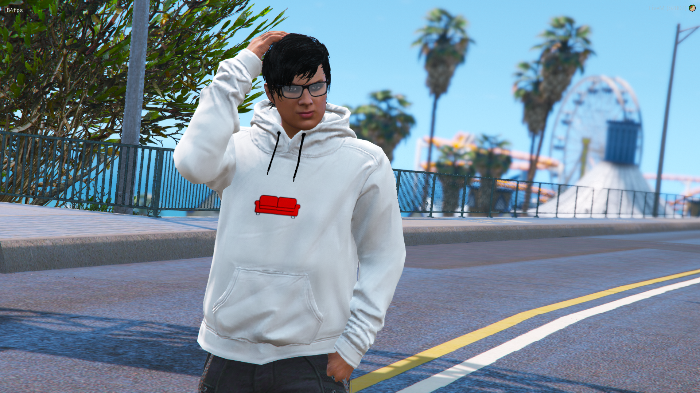
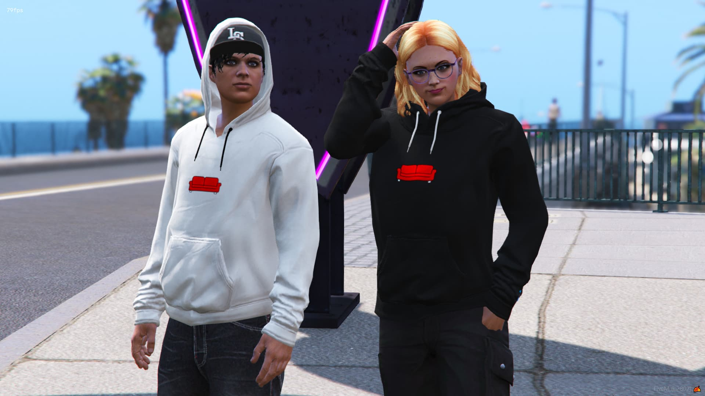
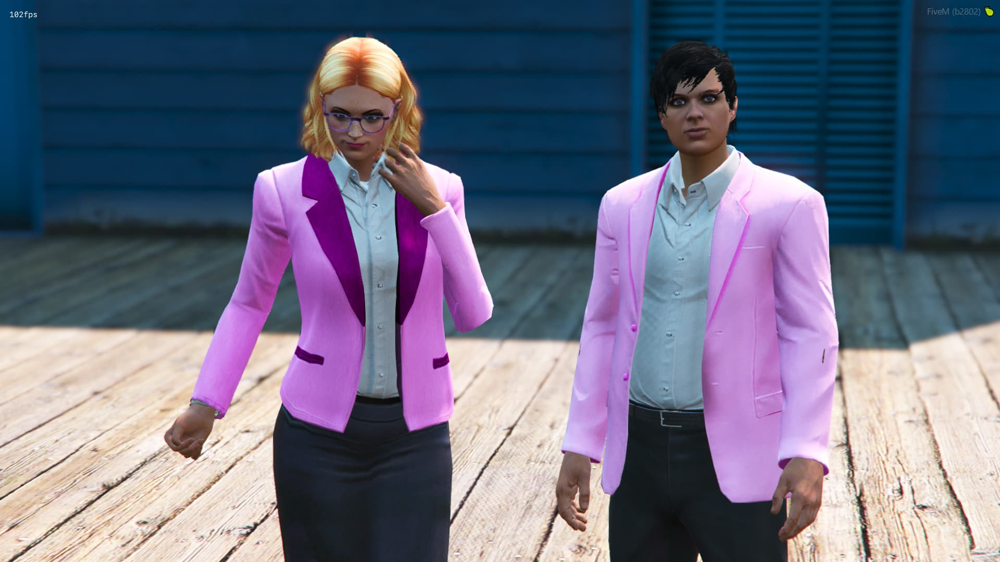

# TaysCrashAdamsPack 🕶️🎸

Crash Adams Clothing Pack For AltV, FiveM &amp; Single Player!

<p align="center">
  <a href="https://github.com/TayMcKenzieNZ/TaysCrashAdamsPack"></a>
  <a href="https://github.com/TayMcKenzieNZ/TaysCrashAdamsPack"></a>
  <a href="https://github.com/TayMcKenzieNZ/TaysCrashAdamsPack"></a>
</p>


# Screenshots 📸

| | | |
|-|-|-|
|  |  |  |
|  |  |  |
|  |  |  |


----------------------------------------------------------------

# CONTENTS:


## Male: 

```
1x Male Sunglasses
1x Male Suit - pink, black checkered
1x Red Couch hoodie (hood down) - black, white
1x Red Couch hoodie (hood up) - black, white
1x Black Checkered suit pants
1x Black Suit Shoes with white socks
```


----------------------------------------

## Female:

```
1x Female Sunglasses
1x Female Suit variant - pink, black checkered
1x Red Couch hoodie (hood down) - black, white
1x Red Couch hoodie (hood up) - black, white
1x Black Checkered suit pants
1x Black Suit Shoes with white socks
```


----------------------------------------

# INSTALLATION INSTRUCTIONS:

## Single Player

- Copy the tayscrashadamspack folder found within the FILES > SINGLE PLAYER folder with the dlc.rpf file to this sub folder of your mods folder: mods/update/x64/dlcpacks (Create it if its not there)

- In order to make the game load this new dlc.rpf file, we need to modify the games dlclist.xml, this can be done by searching for dlclist.xml using OpenIV and copying it to your mods folder: mods/update/update.rpf/common/data (Create it if its not there)

- Open the dlclist.xml and add the following:

dlcpacks:/tayscrashadamspack/

To apply the new clothes you will need some mod menu, suggested ones are:
Menyoo: [https://github.com/MAFINS/MenyooSP/releases](https://gta5-mods.com/scripts/menyoo-pc-sp)

--------------------------------------

## ALTV

Open the FILES folder, go to ALTV and add tayscrashadamspack to your server.cfg as a separate line below resources and before the enclosing. Your server.cfg resources configuration could look similar to this:

resources: [
altv-better-clothing,
tayscrashadamspack
]
Start your server and connect to it

--------------------------------------

## FiveM

- Download vMenu and put it in your server/resources folder [vMenu]( https://github.com/TomGrobbe/vMenu/releases)

- Open the FILES folder and drag the tayscrashadamspack inside the FIVEM folder, into your FiveM resources

- Add ensure tayscrashadamspack to your server.cfg

- Press M to open vMenu and browse thru your new added clothes (They are always added to the end / last DLC clothes)

IF THEY DO NOT APPEAR, YOU DO NOT HAVE THE REQUIRED PATREON SUBSCRIPTION TO STREAM CLOTHING.
